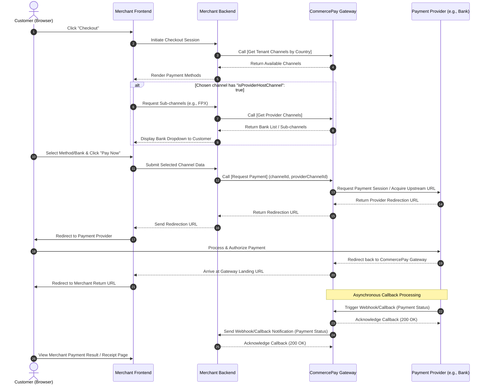

The Direct Integration method allows merchants to maintain complete control over their checkout user experience. Merchants fetch available payment channels directly via API, render them natively on their checkout page, and handle the checkout flow seamlessly before sending the customer to the final payment step.

<Info>
**Recommended for:** Merchants who require full control over their checkout experience and user interface.
</Info>

## Purchase Flow
Below is the visual lifecycle of a Direct Integration transaction.

The complete end-to-end payment flow operates as follows:

<Steps>
  <Step title="Checkout Initiation">
    The customer decides to checkout an order on the merchant's website.
  </Step>
  <Step title="Fetch Tenant Channels">
    The merchant's checkout page calls the [Get Tenant Channels by Country API](/api-reference/get-tenant-channels-by-country) to retrieve all available payment methods for the customer's region and displays them on the native checkout page.
  </Step>
  <Step title="Fetch Provider Options (Conditional)">
    If the payer selects a channel where `"isProviderHostChannel": true`, the merchant system must call the [Get Provider Channels API](/api-reference/get-provider-channels). This retrieves deep-tier options (e.g., specific bank listings for FPX) so the customer can pick their preferred option directly on the merchant's page.
  </Step>
  <Step title="Initiate Payment Request">
    Once the customer confirms their selection and clicks pay, the merchant backend calls the [Request Payment API](/api-reference/direct-integration-api-request-payment), sending the required payload alongside the channelId (and providerChannelId if applicable).
  </Step>
  <Step title="Provider Redirection Fetch (Internal Hop)">
    Upon receiving the request, the CommercePay Gateway immediately communicates with the selected Payment Provider's system to initialize the transaction and fetch the official provider-side redirection URL.
  </Step>
  <Step title="Redirection Handling">
    The Gateway passes this redirection payload back to the merchant backend. The merchant frontend then uses this URL to redirect the customer's browser to the external payment provider's secure page where they complete their authorization.
  </Step>
  <Step title="Provider Webhook/Callback">
    Once the customer finishes the payment process, the upstream Payment Provider asynchronously triggers a webhook notification back to the CommercePay Gateway to communicate the transaction outcome.
  </Step>
  <Step title="Merchant Webhook/Callback">
    Upon receiving and processing the provider's notification, CommercePay instantly fires a signed, asynchronous backend-to-backend HTTP POST callback notification to the merchant's server to securely share the final payment status.
  </Step>
  <Step title="Order Summary Page">
    The customer sees the final merchant payment result, receipt, or order status page based on the transaction updates processed by the merchant's backend.
  </Step>
</Steps>
