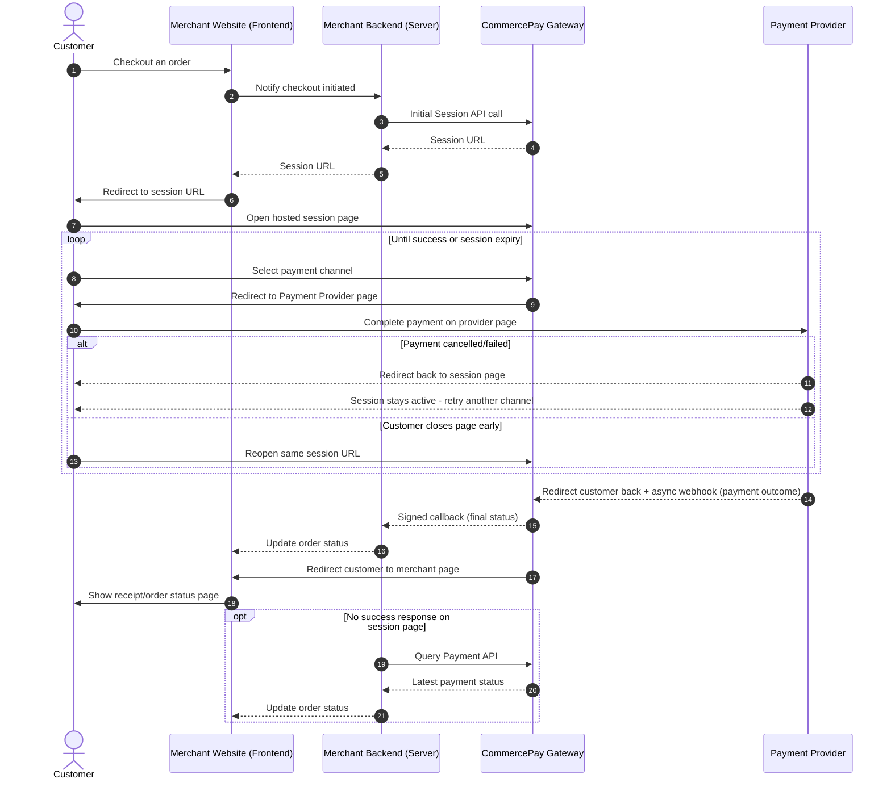

Hosted Session Checkout is an enhanced version of Hosted Checkout that gives merchants a more flexible, persistent payment experience. It's an indirect payment channel: the customer is redirected from the merchant's website to a CommercePay-hosted payment page to complete the transaction.

Unlike a standard hosted checkout, CommercePay holds the payment session open for a single order until the customer successfully completes payment — allowing multiple retries or channel switches without starting a new checkout. This reduces development complexity while improving payment success rate and customer experience.

<Info>
**Recommended for:** Merchants seeking a simple, low-code integration that also needs a persistent session supporting retries and resumable payments.
</Info>

## Purchase Flow
Below is the visual lifecycle of a Hosted Session Checkout transaction.

The complete end-to-end payment flow operates as follows:

<Steps>
  <Step title="Checkout Initiation">
    The customer decides to check out an order on the merchant's website.
  </Step>
  <Step title="Initiate Session Request">
    The merchant backend calls the [Initial Session API](/api-reference/initial-session) to create a payment session for the order. Upon success, CommercePay returns a session URL for the hosted payment page.
  </Step>
  <Step title="Redirect to Session Page">
    The merchant redirects the customer's browser to the returned session URL, landing them on the persistent hosted payment page.
  </Step>
  <Step title="Channel Selection & Payment">
    On the session page, the customer selects a payment channel and completes payment. If the customer cancels or an attempt fails, the session stays active — they can pick another channel and retry without restarting checkout.
  </Step>
  <Step title="Resume Interrupted Sessions (Conditional)">
    If the customer accidentally closes the session page before finishing, the merchant can reuse the same session URL to reopen it and continue payment, as long as the session hasn't expired.
  </Step>
  <Step title="Provider Webhook/Callback">
    Once the customer completes payment, the upstream Payment Provider asynchronously triggers a webhook notification back to the CommercePay Gateway with the transaction outcome.
  </Step>
  <Step title="Merchant Webhook/Callback">
    Upon receiving and processing the provider's notification, CommercePay fires a signed, asynchronous backend-to-backend HTTP POST callback to the merchant's server with the final payment status.
  </Step>
  <Step title="Order Summary Page">
    The customer sees the final merchant payment result, receipt, or order status page based on the transaction update processed by the merchant's backend.
  </Step>
  <Step title="Status Verification (Conditional)">
    If the session page doesn't return a success response, the merchant should call the Query Payment API to retrieve the latest payment status from the Payment Provider.
  </Step>
</Steps>
