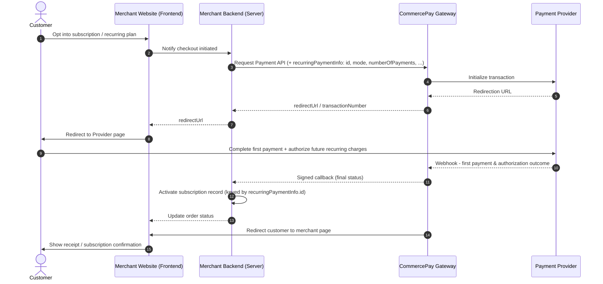
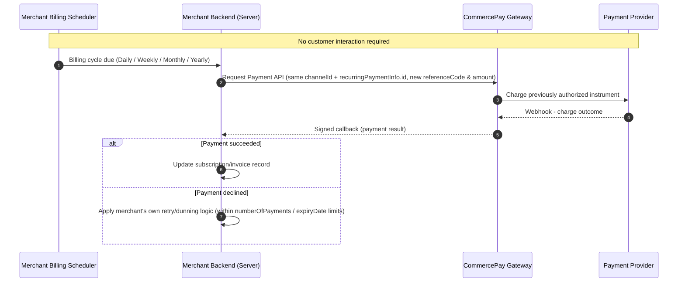

Recurring Payments let merchants automatically charge customers at scheduled intervals — **Daily, Weekly, Monthly, or Yearly** — without the customer manually initiating each payment. This is typically used for subscription-based services, where the customer authorizes the merchant once and the merchant then charges them periodically per an agreed billing cycle.

Recommended for: Subscription or membership merchants using Direct Integration who need to bill customers on a recurring schedule after a one-time authorization.

<Warning>
#### **Important**

Recurring Payments are only available through Direct Integration. They are not supported on Hosted Session Checkout or other integration methods (e.g., e-Commerce plugins).
</Warning>

<Warning>
#### Enabling Recurring Payments

The **Recurring Payments** feature must be approved by our business team before it can be activated for your account. Once approved, the business team will also provide the specific recurring-enabled channel(s) your integration must use — not all payment channels support recurring billing.
</Warning>

## Purchase Flow (Initial Payment & Authorization)

Below is the visual lifecycle of the first payment in a recurring series, where the customer authorizes future charges.

The initial payment flow operates as follows:

<Steps>
  <Step title="Checkout Initiation">
    The customer opts into a subscription or recurring billing plan on the merchant's website and confirms the terms.
  </Step>
  <Step title="Fetch Recurring-Enabled Channels">
    The merchant confirms which channel(s) to use for recurring billing (provided by the CommercePay business team during enablement) and, if applicable, calls Get Provider Channels for deeper options.
  </Step>
  <Step title="Initiate First Payment Request">
    The merchant backend calls the [Request Payment API](/api-reference/direct-integration-api-request-payment) with the usual payment fields, plus a **recurringPaymentInfo** object that registers the subscription: **id, mode, numberOfPayments**... (**Channel-specific fields, see table below**)
  </Step>
  <Step title="Provider Redirection & Consent">
    CommercePay contacts the payment provider, and the customer is redirected to the provider's page to complete the first payment and authorize future recurring charges (e.g., saving card details or DuitNow proxy consent).
  </Step>
  <Step title="Provider Webhook">
    The payment provider asynchronously notifies CommercePay of the first payment and authorization outcome.
  </Step>
  <Step title="Merchant Callback">
    CommercePay sends a signed backend-to-backend callback to the merchant with the first payment result. On success, the merchant activates the subscription record tied to **recurringPaymentInfo.id**.
  </Step>
  <Step title="Order Confirmation">
    The customer sees a receipt or subscription confirmation page.
  </Step>
</Steps>

## Subsequent Payments (Recurring Billing)

Once the customer has authorized the first payment, CommercePay does not automatically collect future charges — the merchant is responsible for initiating every subsequent payment. Below is the visual lifecycle of a subsequent (recurring) charge, which requires no customer interaction.

The subsequent payment flow operates as follows:

<Steps>
  <Step title="Billing Cycle Trigger">
    The merchant's own billing/scheduler system determines that a payment is due for a subscription, per the agreed cycle (Daily/Weekly/Monthly/Yearly).
  </Step>
  <Step title="Initiate Subsequent Payment Request">
    The merchant backend calls the [Request Payment API](/api-reference/direct-integration-api-request-payment) again, using the same channel and the same **recurringPaymentInfo.id** established during the first payment, with a new **referenceCode** and **amount** for this billing cycle. No customer redirection is involved.
  </Step>
  <Step title="Provider Processing">
    CommercePay forwards the charge to the payment provider, which processes it against the previously authorized instrument.
  </Step>
  <Step title="Provider Webhook">
    The provider asynchronously notifies CommercePay of the charge outcome.
  </Step>
  <Step title="Merchant Callback">
    CommercePay sends a signed callback to the merchant with the result of that billing cycle's payment.
  </Step>
  <Step title="Status Handling">
    The merchant updates its subscription/invoice records. If the charge is declined, the merchant handles retry logic on its own (within the **numberOfPayments** / **expiryDate** limits set at authorization time).
  </Step>
</Steps>

## Recurring Payment Info — Required Fields by Channel
All channels require: **id, mode, numberOfPayments**.

Field | 	Credit Card | Description
---------|----------|---------
 id | ✅ | Unique ID assigned by the merchant to identify the subscription/customer for recurring payments
 mode | ✅ | **1**=Daily, **2**=Weekly, **3**=Monthly, **4**=Yearly
 numberOfPayments | ✅ | Max recurring frequency count, up to 999 (e.g., mode=Monthly + numberOfPayments=12 = 1 year of monthly charges)
 expiryDate | ✅ | Recurring expiry date, format **ddMMyyyy** (e.g. **20122022**)
 isFixedAmount | ✅ | Whether every recurring charge is a fixed amount
 maximumPaymentAmount | - | Maximum amount allowed per recurring charge
 effectiveDate | optional | 	Recurring start date, format **ddMMyyyy**
